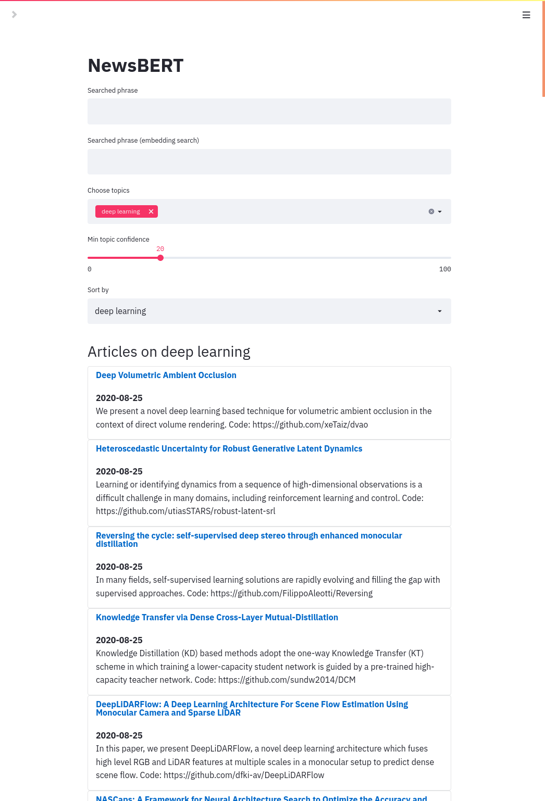

# NewsBERT 

Using BERT & other transformer models for organizing RSS feed data



[](https://colab.research.google.com/drive/1o2Aitk5jtz9UdrhyfkYYEop2U5O3jqrj?usp=sharing)


## Setup

```
pip install nbdev
nbdev_build_lib; pip install -e .
```

## Run the app

```
streamlit run streamlit/newsbert_app.py
```